## Introduction

In September 2020, Twitter released a new API [endpoint](https://developer.twitter.com/en/docs/twitter-api/early-access) that now includes several useful [fields](https://developer.twitter.com/en/docs/twitter-api/metrics) that were not previously available (e.g., like counts and impression data).  Creating Python scripts to interact with the new API is useful to enable future studies that use these new fields.    

This repository provides Python modules to query the v2 Twitter API, instructions on how to create a locally-hosted MySQL database, modules to translate Twitter data to SQL, and modules to create interactive network graphs.  Storing data in MySQL database with an edge list table makes it easier to generate and explore mention, hashtag, or URLs network graphs.

---------
## Data Collection

The analytic workflow starts with collecting data from the v2 Twitter API by using functions found in the [`api_wrapper`](https://github.com/GWU-DBMS-For-Analytics/koban_xie_twitter_v2_api/blob/main/api_wrapper.py) module. In order to reproduce this workflow, users must first request a bearer token from the [Twitter developer portal](https://developer.twitter.com/en/portal/projects-and-apps).  Developer tokens are required to authenticate with the API.  

In this example, we query a set of Twitter accounts that were previously identified to post pro or anti-vaccination content by calling the `get_users` function.  Seed user names are provided in the `seed_accounts.csv` file in the `data` folder on this GitHub repository. 

Since, the Twitter [API rate limit](https://developer.twitter.com/en/docs/twitter-api/rate-limits#v2-limits) for user look up queries is 900 accounts per 15 minute, the [DataCollection Notebook](https://nbviewer.jupyter.org/github/GWU-DBMS-For-Analytics/koban_xie_twitter_v2_api/blob/main/DataCollection.ipynb) incorporates timing delays between requests to prevent time outs. The workflow also incorporates error handling for empty responses that result when querying deleted or suspended accounts.    

__code images were generated using [Carbon](https://carbon.now.sh/)__
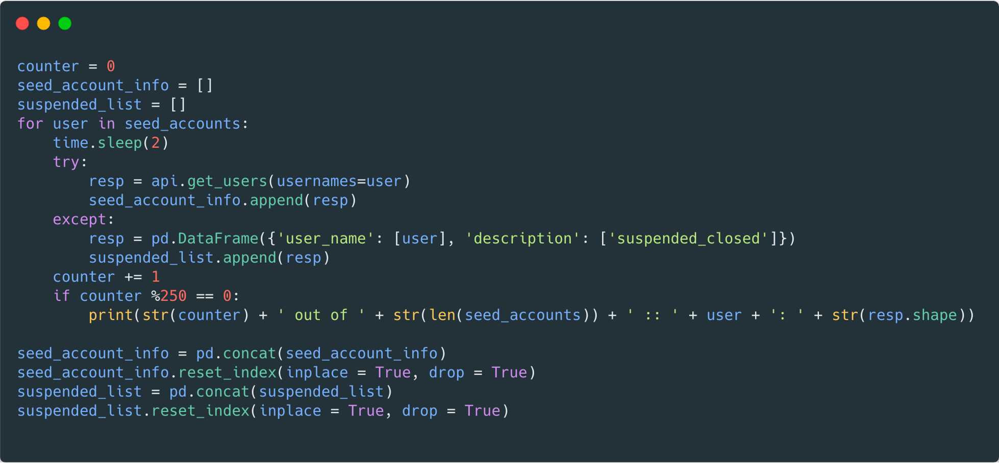

Next, we query seed accounts for their last 200 posts by calling the `get_user_activity` function.  Since useful information (e.g., public metrics) is nested within the user activity json objects, the `get_user_activity` function extracts and appends data into additional columns where possible.  

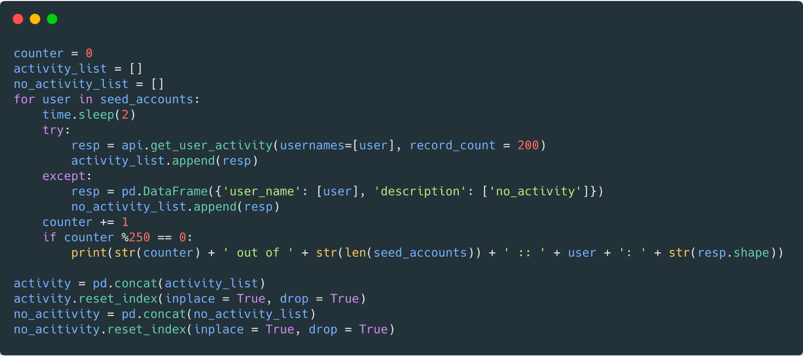

We call the `extract_el` function to parse mentions, hashtags, and URLs into a directed edge list.  Source nodes in this edge list record the `author_id` and `author_screen_name` of users who mention entities (i.e., users, hashtags, or URLs).  Since users can mention several entities in individual posts, the activity data has a one-to-many relationship with the edge list. In this example, 783 seed users mentioned 49,022 users. 

Although we did not peform additional data collection beyond what was mentioned, we could easily incorporate additional steps if needed.  For example, we could collect user profile information for the 49,022 mentioned users.  We could incorporate information from additional sources (e.g., query the Botometer API for bot likelihood scores).  We could expand our analysis to a 2-hop network by querying mentioned users for account activity. 

To make the [`api_wrapper`](https://github.com/GWU-DBMS-For-Analytics/koban_xie_twitter_v2_api/blob/main/api_wrapper.py) module more effective, we need to improve error handling, identify optimal sleep times for deailing with rate limits, transition the API functions to a class object, improve documentation of available Twitter object fields, and write API response to json files as opposed to csv files.

---------
## Creating a MySQL Database

In retrospect, we would have preferred to create a cloud-hosted MySQL database using Amazon's Relational Database Service (RDS).  A cloud-hosted database would allow all team members to interact with a single database remotely.  Instead, we created [Docker](https://www.docker.com/) container to locally host a MySQL database.  We did this for two reasons: 1) it doesn't cost anything to locally host a database, and 2) we were not familiar with how to set up a RDS database.  
To create the Docker container, we created an empty directory and added the following Docker yml file to it:

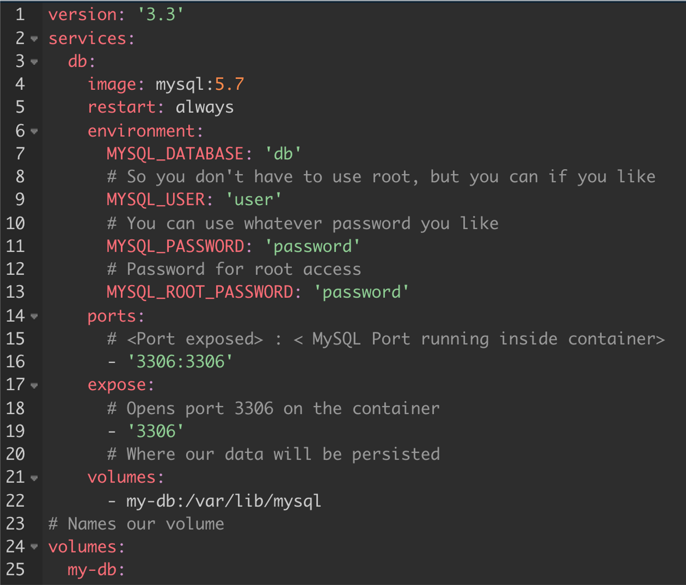

Then, we navigated to the directory with the .yml file and executed the `docker compose up` command.  

---------
## Translating Data to MySQL

The [DataETL_ToMySQL](https://nbviewer.jupyter.org/github/GWU-DBMS-For-Analytics/koban_xie_twitter_v2_api/blob/main/DataETL_ToMySQL.ipynb) notebook provides an overview of the steps we used to create SQL table schemas and write csv data files to our database. The entity relationship diagram of our database is shown below:

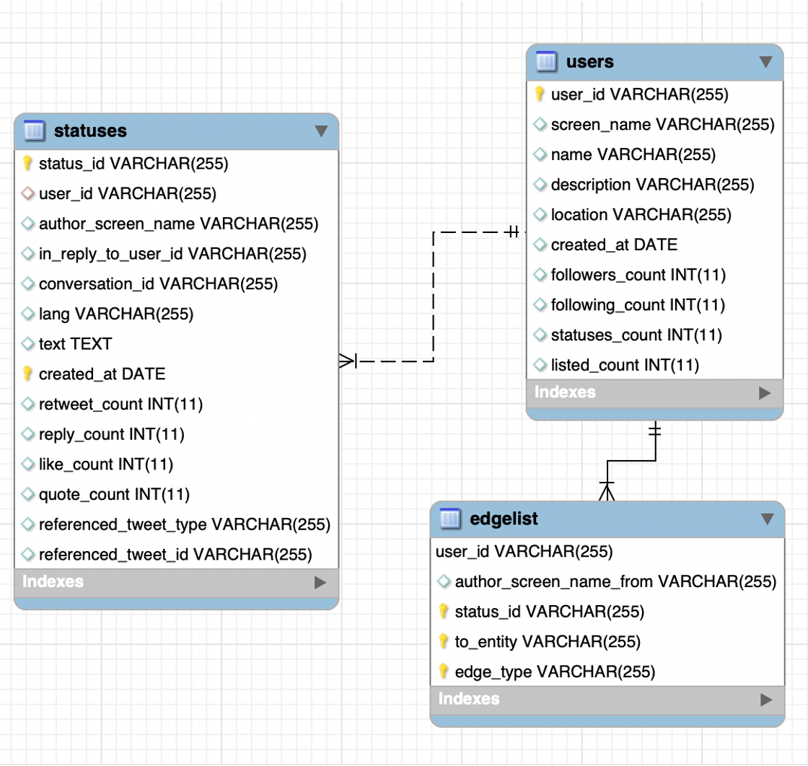

Below is an example of an ETL workflow for the `users` table. First, we create a SQL table where we specify the data types for each of the fields.

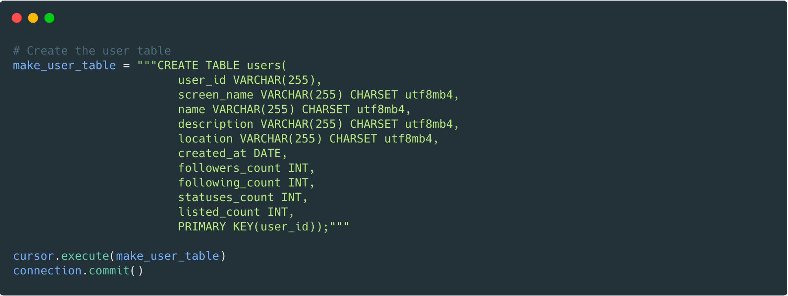

Next, we load the data we collected in the previous step and transform fields where appropriate (e.g., converting dates to date objects).  In this example, we also had to replace apostrophes found within text fields with spaces because including them caused errors in the write step.  

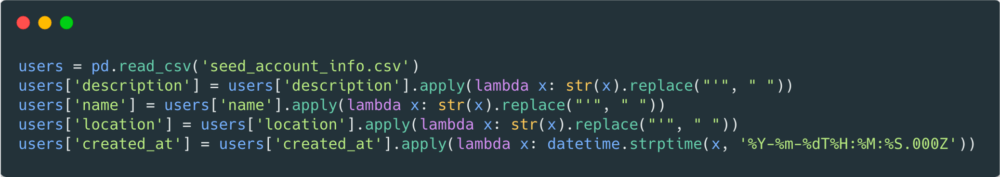

Last, we write the data, row-by-row, to the SQL database.

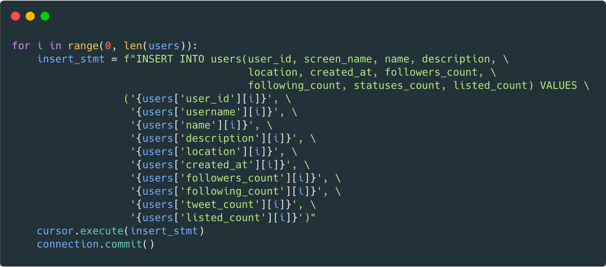

---------
## Data Analysis and Visualization

Now that the data is stored in a SQL database, we can query the data using the `pymysql` package and [`network_vis_helper`](https://github.com/GWU-DBMS-For-Analytics/koban_xie_twitter_v2_api/blob/main/network_vis_helper.py) module.  A simple example is provided in the [DataAnalysisVisualization](https://nbviewer.jupyter.org/github/GWU-DBMS-For-Analytics/koban_xie_twitter_v2_api/blob/main/DataAnalysisVisualization.ipynb) notebook to demonstrate how users can interact with the database and to highlight the benefit of writing more effective queries (i.e., not using a SELECT * approach).  

For example, if we want to view the top-10 most liked tweets, it takes over 5 seconds to load the entire `statuses` table into memory and use Python to filter the data to the top 10-records.  

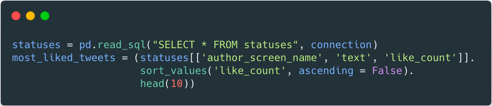

In contrast, if we answer this question using only SQL commands, it executes in less than a second (~0.12 seconds)

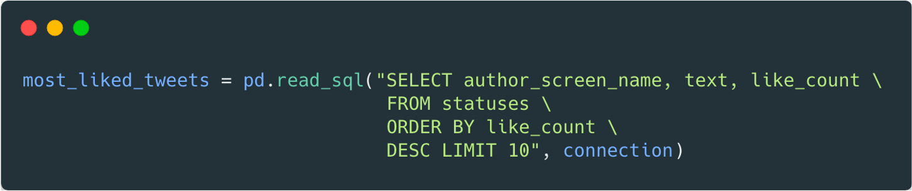

Another advantage is that we can leverage the structure of the `edgelist` table to easily generate network visualizations.  For example, we can quickly generate a graph of the most popular hashtags as follows:

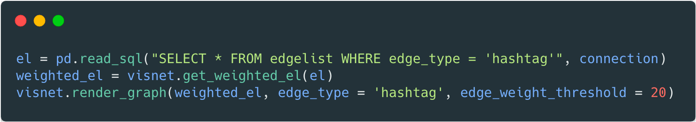

A static image of the graph is provided below (orange squares are users; grey circles are hashtags; hashtag node sizes are scaled based on counts; edge widths are scaled based on how often an account used each hashtag); An html-version of this graph allows a user to explore the graph interactively (e.g., zoom, reposition nodes, etc.) and can be viewed at the following [link](https://nbviewer.jupyter.org/github/GWU-DBMS-For-Analytics/koban_xie_twitter_v2_api/blob/main/DataAnalysisVisualization.ipynb).

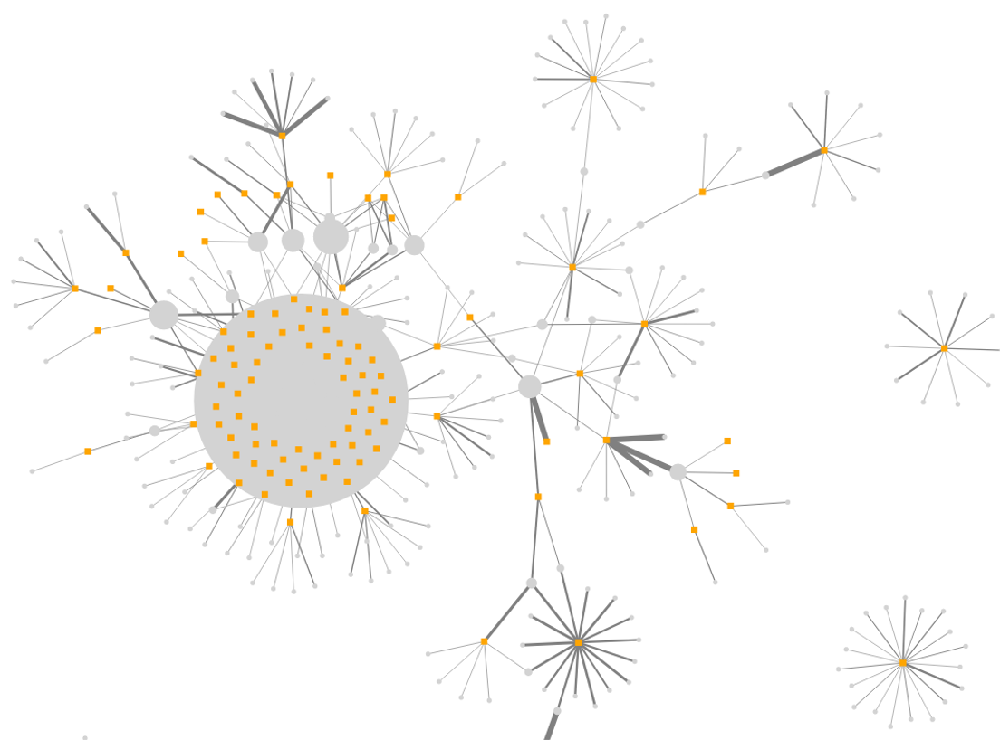

Now that the data is in more useable format we can start to think about additional node and edge attributes to add to our node list (i.e., the `users` table) and our edge list.  For example, we could classify accounts as pro or anti-vaccine based on their posting activity (i.e., do they use predominately pro or anti-vaccine hashtags?).  Adding this attribute would allow us to determine if the mention network contains polarized communities of pro and anti-vaccine users.  We could incorporate bot-likelihood scores to assess the proportion of bots within the network or identify hashtags that are used more often by bots.  