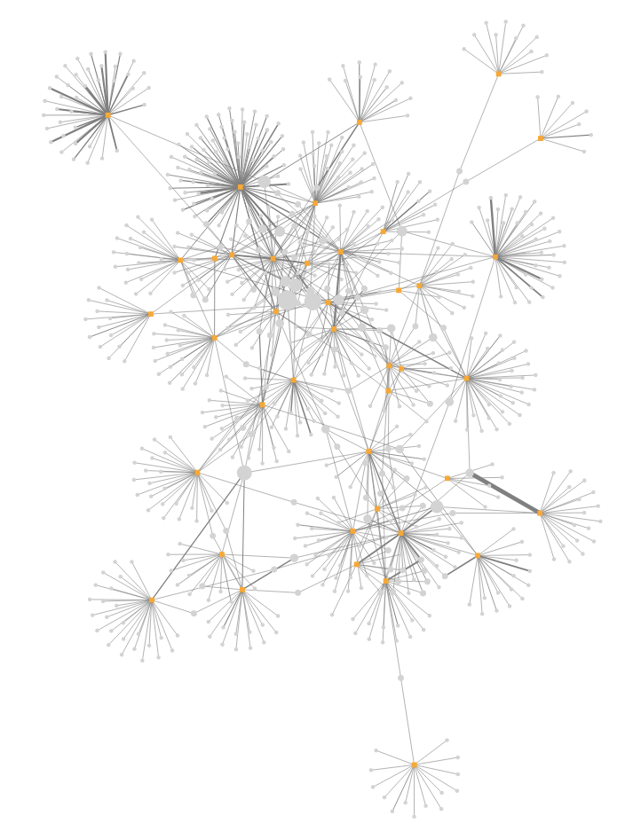

# V2 Twitter API ETL to MySQL

As of September 2020, Twitter released a new API [endpoint](https://developer.twitter.com/en/docs/twitter-api/early-access) and modified the payload of the new twitter objects.  The new payload now includes several useful [fields](https://developer.twitter.com/en/docs/twitter-api/metrics) that were not previously available (e.g., like counts and impression data)    

The following repo provides Python wrappers to query the new Twitter API, ETL scripts to store data in a MySQL database, and Jupyter notebooks to interact with the database.

1. `DataCollection.ipynb`: Jupyter notebook to collect data via the Twitter API
2. `docker-compose.yml`: Docker yml file to create a locally hosted MySQL container
3. `DataETL_ToMySQL.ipynb`: Jupyter notebook to create MySQL table structure and translate Twitter data to MySQL
4. `DataAnalysisVisualization.ipynb`: Jupyter notebook to create mention, hashtag, and url networks.

